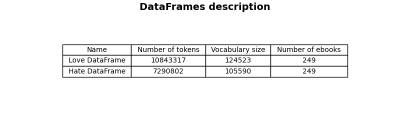
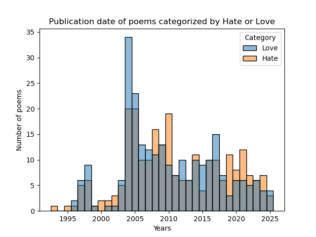
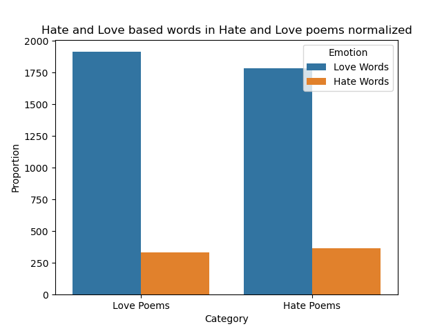

# project11_NLP
Project 11 : Natural Language Processing : Love and Hate in Poetry

# Prerequisites

## Gutenberg Index

[Machine readable index](https://www.gutenberg.org/cache/epub/feeds/rdf-files.tar.bz2)

We have used this index for scraping and identifying similar poems, the file hierarchy should look like this after unzipping:
```
project11_NLP/
├── gutenberg_rdf/
│   └── cache/
│       └── epub/
│           └── (RDF FILES)
```

## Dependencies

Install the required dependencies:
```bash
pip install -r requirements.txt
```

# Tasks

## 1

Task is implemented in 'dataframe_stat.py'



## 2

Task is implemented in `histogram_of_publication.py`:



## 2


