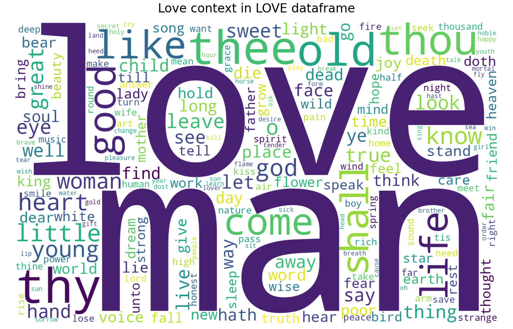
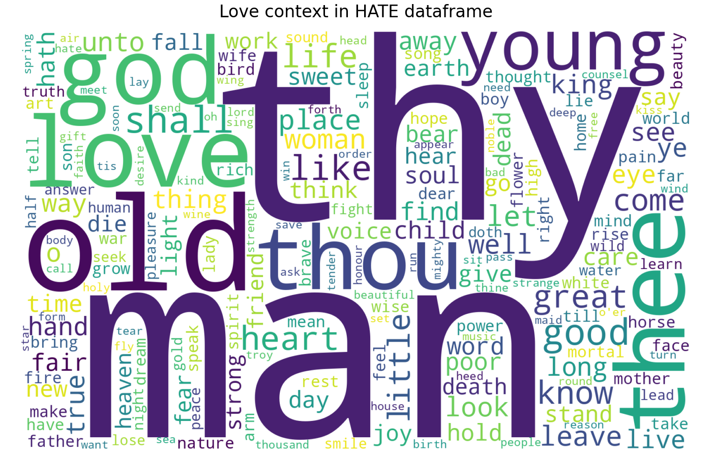
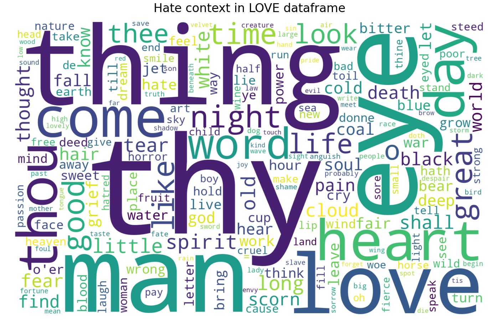
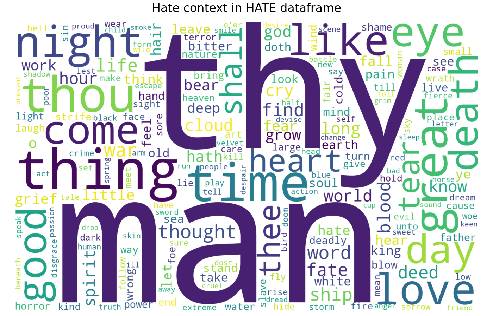
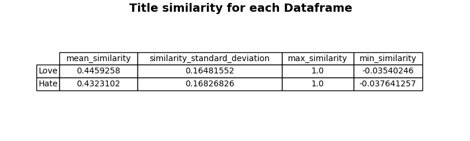

# project11_NLP
Project 11 : Natural Language Processing : Love and Hate in Poetry
A detailled description of the project and the objectives of each task can be found in :
['task_description.txt'](task_description.txt) 

# Prerequisites

## Gutenberg Index

[Machine readable index](https://www.gutenberg.org/cache/epub/feeds/rdf-files.tar.bz2)

We have used this index for scraping and identifying similar poems, the file hierarchy should look like this after unzipping:
```
project11_NLP/
├── gutenberg_rdf/
│   └── cache/
│       └── epub/
│           └── (RDF FILES)
```

## Project hierarchy

After running the scripts, the project structure is as follows :

```
project11_NLP/
├── gutenberg_rdf/
│   └── cache/
│       └── epub/
│           └── (RDF FILES)
├──data/
│   └── cache/ 
│   └── csv/
│       └── context_count/
│       └── partial_context_count/
│       └── hate.csv
│       └── love.csv
│   └── lexical_diversity/
│   └── texts/
├──img/
├──script1.py
├──script2.py
├──script3.py
└──...

```

 - The **`img/`** contains the results and figures generated for each tasks (detailled in bellow).
 - In **`data/csv/`**, the files `hate.csv` and `love.csv` correspond to the Hate and Love DataFrames used across all scripts. 
 - The **`data/text/`** folder contains the raw text of the downloaded e-books. 
 - All other folders and files inside **`data/`** are intermediate outputs used to stored processed data and plotting results.  

## Dependencies

Install the required dependencies:
```bash
pip install -r requirements.txt
```

# How to run the project
1. Download the Gutenberg index and unzip it in the project root folder
2. Run the following scripts in order:
    ['df_const.py'](df_constr.py) - Builds the lists of Love and Hate poems from the Gutenberg index
    ['scrape_to_csv.py](scrape_to_csv.py) - Scrape the text and create CSV files for each dataframes
3. Then you can run one by one the task described bellow

# Tasks

## 1

Task is implemented in [`dataframe_stat.py`](dataframe_stat.py)


## 2

Task is implemented in [`histogram_of_publication.py`](histogram_of_publication.py):


## 3

Task is implemented in [`hate_and_love_terms_proportions.py`](hate_and_love_terms_proportions.py)


## 4

Task is implemented in [`H&L_context_words.py`](H&L_context_words.py)






## 5

Task is implemented in []()


## 6

Task is implemented in []()


## 7 and 8

Task is implemented in []()


Average Semantic Similarity between top 100 frequent words and vocabularies:
```
Love & Love Vocab: 0.35974183678627014
Hate & Love Vocab: 0.3619268536567688
Hate & Hate Vocab: 0.3463706374168396
Love & Hate Vocab: 0.3427005112171173
``` 

## 9
Task is implemented in [`df_titles_diversity.py`](df_titles_diversity.py)


## 10

Task is implemented in [`lexical_diversity.py`](lexical_diversity.py)


